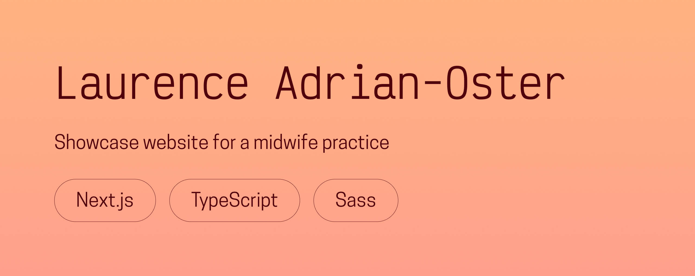

# 🌼 Laurence Adrian-Oster

**A showcase website for a midwife practice, designed and developed with Next.js, TypeScript, and Sass.**  
Created in 2025 to combine clarity, accessibility, and gentle design.

---

## 🌟 Overview
This website was created for Laurence Adrian-Oster and Caroline Bigorgne, two midwives based in France, to present their practice and share essential information with patients.  

The goal was to design a website that feels **warm, trustworthy, and easy to navigate**, while ensuring strong accessibility and performance.  
It features sections for services, philosophy, and contact details, all wrapped in a calm, welcoming design system.

Built with **Next.js**, **TypeScript**, and **Sass**, the site balances simplicity with maintainability, focusing on lightweight animations, clear hierarchy, and readability on all devices.

---

## 🖥️ Live demo
👉 [**Visit the website**](https://laurence-adrian-oster-sage-femme.netlify.app/)  

You can also see its dedicated project page on my [**portfolio**](https://chloeadrian.dev/en/project/laurenceadrianoster).

---

## ⚙️ Tech stack
- **Next.js** for structure and performance  
- **TypeScript** for clean, type-safe code  
- **Sass** for modular and maintainable styles  
- **Figma** for layout and design exploration  

---

## 🧠 Key features
- Clean, accessible layout optimized for clarity and readability  
- Fully responsive design for all devices  
- Warm, minimalist visual identity inspired by natural tones  
- Fast load times and SEO-friendly structure  
- Built with a focus on accessibility and user comfort  

---

## 🕊️ Reflection
This project was a meaningful collaboration, blending **personal connection and professional craftsmanship**.  
It allowed me to explore **tone, emotion, and usability**, and to try my hand at translating a nurturing, human profession into a digital space that feels approachable and authentic.

---

Thanks for reading, and take care!  
Chloé Adrian ✨